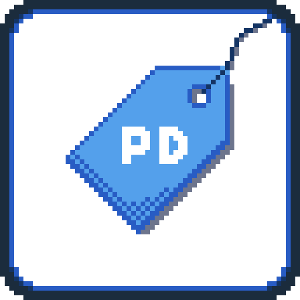
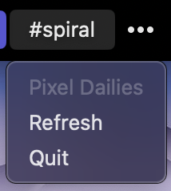
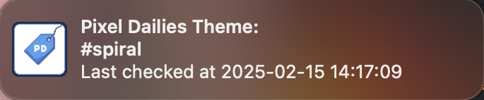

# PDBar
### "Pixel Dailies Bar"

A **Mac OS** menu bar app that displays the [Pixel Dailies](https://mastodon.art/@pixel_dailies) theme

## Getting Started

Start the app and it will automatically fetch the [Pixel Dailies](https://mastodon.art/@pixel_dailies) theme for the day

The app will refresh **every hour** while running, but you can also click on "Refresh" in the menu to refresh manually

You'll get a notification from the app when the `#tag` changes

## Installation

You can find the latest release of PDBar [here](https://github.com/JRiggles/PDBar/releases/latest) on the Releases page

To download the app, just click on the "Assets" dropdown and then click on the "PDBar.app.zip" link

Once you've donwloaded the file, simply unzip it and move PDBar to your Applications folder

## Build it Yourself

You can also build the app yourself!

> [!NOTE]
> You'll need Python installed (this app was built using Python 3.12)

1. Clone this repo
2. Open a terminal and navigate to the root of the cloned directory, **PDBar**
3. Run the command `pip install -r requirements.txt` to install the necessary dependencies (you may want to do this in a `venv`, but it's not strictly required)
4. Run the command `python setup.py py2app` to build the app

If everything worked, you'll find the app here:

`{wherever you cloned the repo}/PDBar/dist/PDBar.app`

## Dependencies

  - [Feedparser](https://feedparser.readthedocs.io/en/latest/index.html)
  - [py2app](https://py2app.readthedocs.io/en/latest/index.htm)
  - [Rumps](https://github.com/jaredks/rumps?tab=readme-ov-file)

## Acknowledgements

Thanks to Pixel Dailies for the daily inspiration!

*All copyrights are property of their respective owners*
